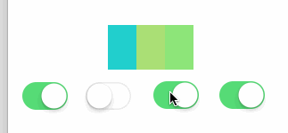
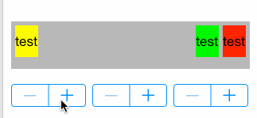
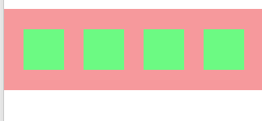

# AceMasonryExample
Example For Masonry

#demo1
4个开关分别控制4个view的显示与隐藏，不管显示几个view，总体始终居中。

#demo2
3个label，实现label1靠左，label3靠右，label2紧靠label2。当增加文字时，最大化满足label3的显示，其次是label2，最后是label1。

#demo3
当屏幕宽度增加时，保持子view的宽度不变，而改变view直接的间隔。

